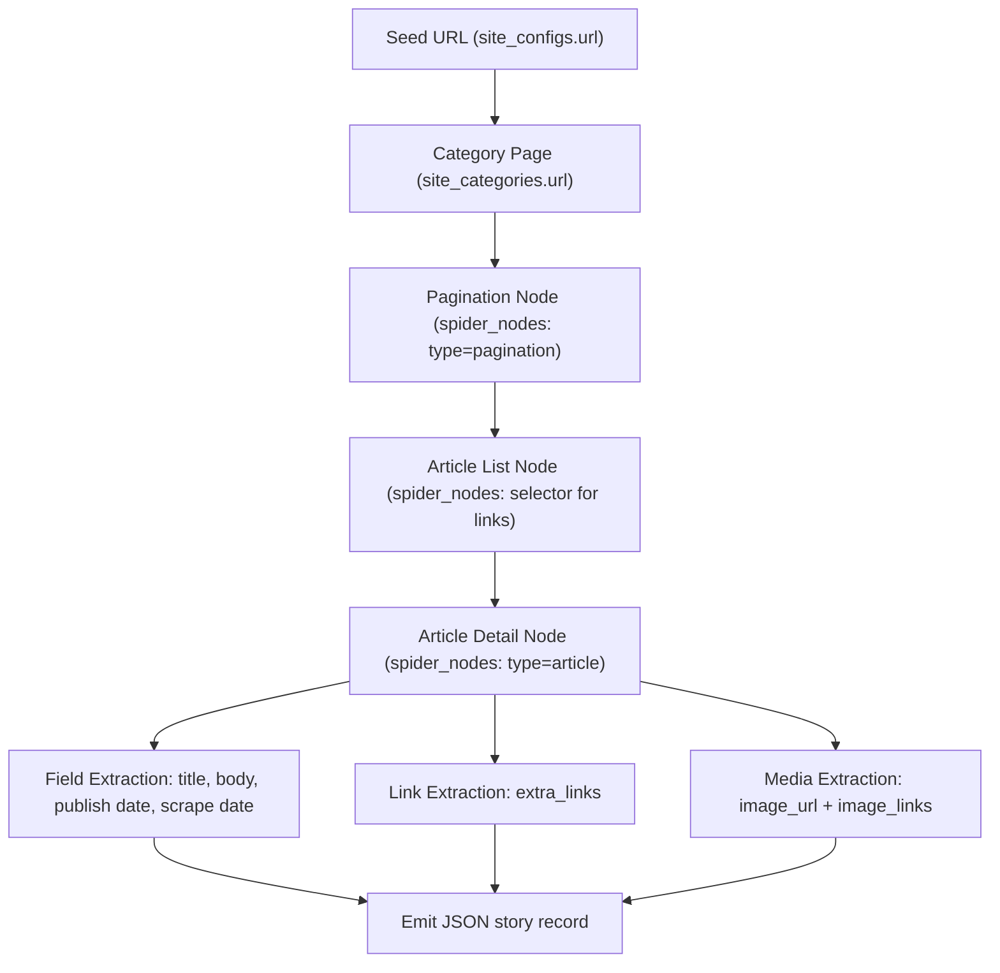

# Metadata, Strategy, and Spider Model

This project now supports a full SQL model for:

- Website metadata (`country`, `language`, `domain`, server details, technology stack summary)
- Per-site category planning (`site_categories` with page patterns and page counts)
- Category crawl coverage (`category_crawl_state` for links/pages/emits)
- Scraping strategy and anti-blocking guidance (`scrape_strategies`)
- Spider diagram graph definitions (`spider_diagrams`, `spider_nodes`, `spider_edges`)
- URL-level scrape ledger (`article_url_ledger`) for dedupe and progress tracking
- Rich article fields emitted to JSON (`title`, `body`, `publish date`, `scrape date`, `extra links`, `image links`, plus enrichment fields)
- Line-by-line LLM governance (`llm_assessment_runs`, `llm_assessment_lines`)

## Core Tables

- `site_configs`: site identity + metadata + base selectors + defaults.
- `site_technologies`: detected technologies per site (CMS/framework/CDN/WAF, version, confidence).
- `site_categories`: crawl categories and max pages per category.
- `category_crawl_state`: crawl coverage checkpoints per category.
- `scrape_strategies`: what scraper stack to use and what blocking to handle.
- `spider_diagrams`: versioned spider plans per site.
- `spider_nodes`: crawl/extraction steps in a spider plan.
- `spider_edges`: transitions between spider nodes.
- `article_url_ledger`: dedupe/progress state without article body storage.
- `llm_assessment_runs`: periodic governance runs.
- `llm_assessment_lines`: one row per assessed field/value line item.

## Spider Diagram (Reference)



## Scraped Fields

Required:
- `title`
- `body`
- `date_publish`
- `scrape_date`
- `extra_links`
- `image_links`

Also captured by default:
- `canonical_url`
- `description`
- `authors`
- `section`
- `tags`
- `source_domain`
- `language`
- `word_count`
- `reading_time_minutes`
- `raw_metadata`
- `content_hash`

## LLM Line-by-Line Governance Workflow

1. Create a run:
```bash
python -m news_scraper prepare-assessment --url "https://example.com/news" --model "gpt-4.1-mini"
```

2. Export payload for LLM:
```bash
python -m news_scraper export-assessment <run_id> --output ./data/assessment_run_<run_id>.json
```

3. LLM reviews each line and returns decisions (`keep` / `update` / `review` / `remove`).

4. Apply approved updates:
```bash
python -m news_scraper apply-assessment <run_id> ./data/assessment_run_<run_id>_reviewed.json
```

5. Schedule this regularly (daily or weekly) to keep site configs, spider maps, and anti-blocking tactics current.

## Reviewed Line Format

```json
{
  "lines": [
    {
      "line_number": 12,
      "recommended_action": "update",
      "suggested_value": "pydoll",
      "reasoning": "Site now blocks non-browser requests with JS challenge.",
      "confidence_score": 0.89
    }
  ]
}
```
